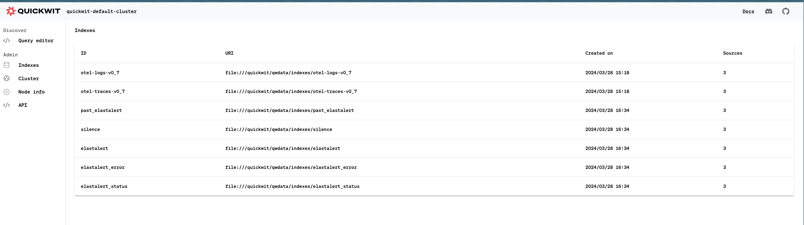

# Quickwit tests

A complete scenario for testing `elastalert2` with Quickwit.

## Getting started

```shell
docker-compose up --build --force-recreate
```

You should be able to access to the quickwit GUI here: http://localhost:7280

You should see the following indexes created by elastalert:



Create a `container` index with some data:

```shell
curl localhost:7280/api/v1/indexes -X POST -H "Content-Type: application/json" -d @mapping.json -v
curl localhost:7280/api/v1/containers/ingest -X POST -H "Content-Type: application/json" -d @data.json -v
```
